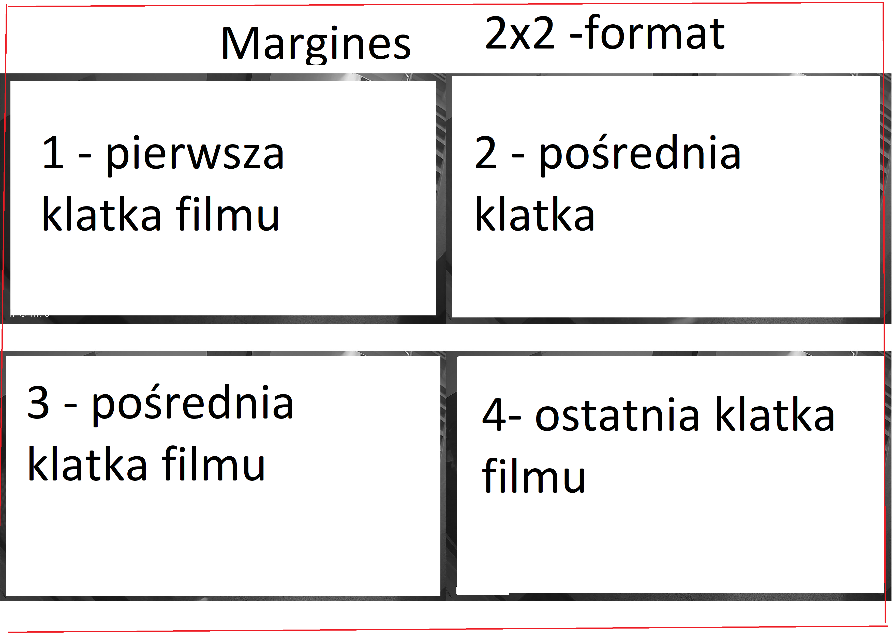

# Tworzeie Kolaży z plików filmowych do wydruku 


## Obsługiwane formaty wideo

- DAV  
- MP4  
- AVI  
- MKV  
- MOV  
- FLV  

## Uruchomienie

W katalogu znajduje się program główny `main.py`. Aby go uruchomić, wpisz:

```bash
python main.py

## Rezulatat dla 2x2


